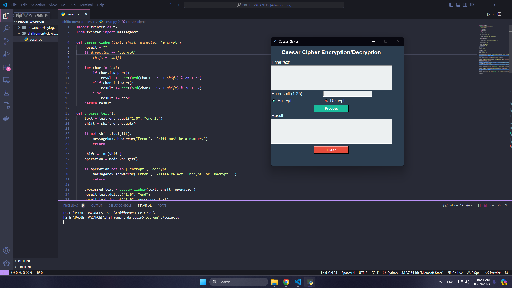

# Caesar Cipher GUI

## Introduction

This is a simple Python project that implements a **Caesar Cipher** with a graphical user interface (GUI) using the **Tkinter** library. The application allows users to encrypt and decrypt text using the Caesar Cipher method. Users can enter the text, choose whether to encrypt or decrypt, and specify the shift (key) value.

## Features

- Encrypt text using Caesar Cipher.
- Decrypt text using Caesar Cipher.
- Customizable shift/key (1-25).
- Graphical user interface (GUI) for ease of use.
- Clear text and result fields.

## How the Caesar Cipher works

The Caesar Cipher is a type of substitution cipher where each letter in the plaintext is shifted by a certain number of positions in the alphabet. For example, with a shift of 3:

- 'A' becomes 'D'
- 'B' becomes 'E'
- 'Z' becomes 'C' (wraps around the alphabet)

To decrypt, the process is reversed by shifting in the opposite direction.

## Requirements

- Python 3.x
- Tkinter (comes pre-installed with most Python distributions)

## Installation

1. Clone this repository or download the files.
   ```bash
   git clone https://github.com/your-repo/caesar-cipher-gui.git
   ```
2. Navigate to the project directory
   ```bash
   cd chiffrement-de-cesar
   ```
3. Run the cesar.py
   ```bash
   python3 cesar.py
   ```

## Usage

1. Enter the text you want to encrypt or decrypt in the Enter text field.
2. Enter the shift/key value in the Enter shift (1-25) field.
3. Choose either Encrypt or Decrypt using the radio buttons.
4. Click the Process button to see the result in the output area.
5. You can clear the input and output fields using the Clear button.

## Code Structure

- **`cesar.py`**: The main script that contains the GUI and the Caesar Cipher logic.
- **`caesar_cipher`**: Function that implements the Caesar Cipher encryption and decryption.
- **`process_text`**: Function that processes the input text based on user selection (encrypt or decrypt).
- **`clear_fields`**: Function that clears the input and output fields.

## Visual Representation

Here’s a visual representation of how the text boxes are arranged in the application:


## Example

Here are some examples of how to use Caesar Cipher:

### Encryption Example:

1. **Input Text**:

   - Enter the following text in the input box:

   ```
   hello
   ```

2. **Shift**:

   - Enter the shift value of `3` in the shift input field.

3. **Operation**:

   - Select the **Encrypt** option.

4. **Process**:

   - Click the **Process** button.

5. **Result**:
   - The output will be displayed in the result box:
     ```
     khoor
     ```

### Decryption Example

1. **Input Text**:

   - Enter the following text in the input box:
     ```
     khoor
     ```

2. **Shift**:

   - Enter the shift value of `3` in the shift input field.

3. **Operation**:

   - Select the **Decrypt** option.

4. **Process**:

   - Click the **Process** button.

5. **Result**:
   - The output will revert back to the original text:
     ```
     hello
     ```
